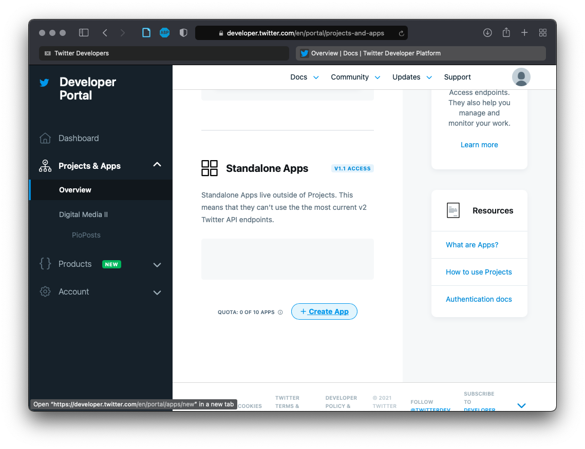
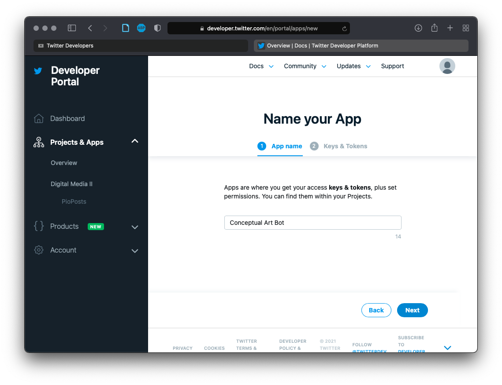
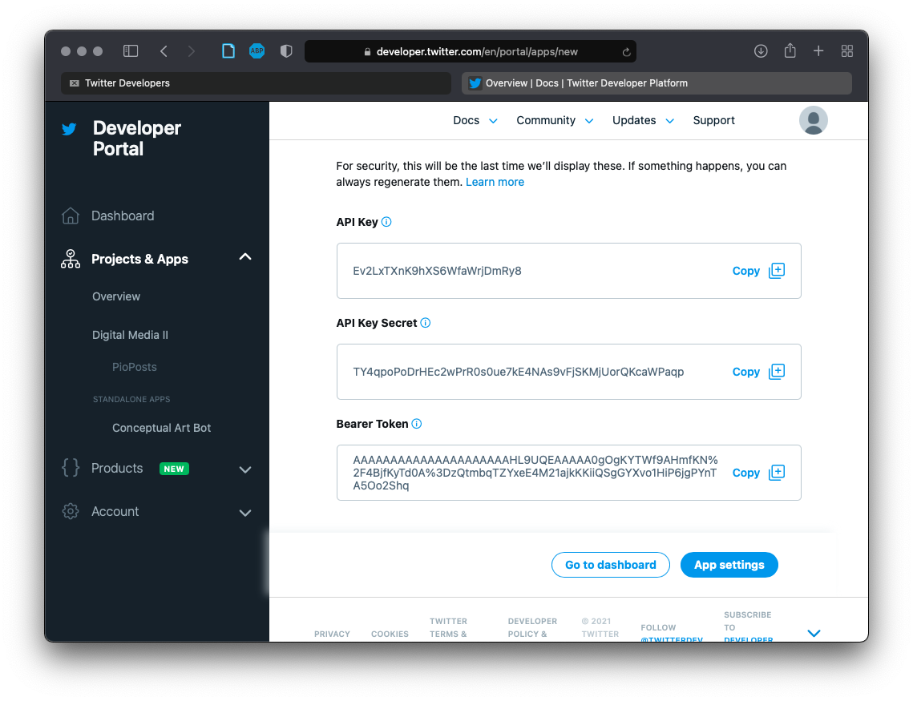
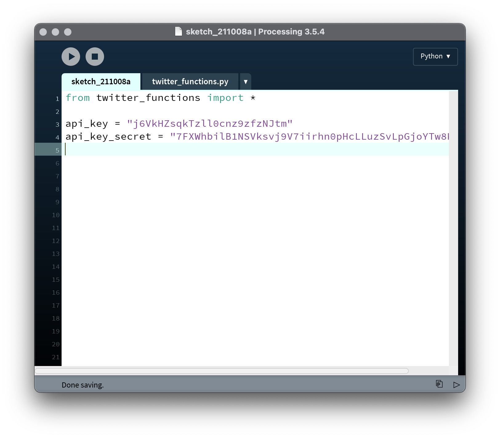
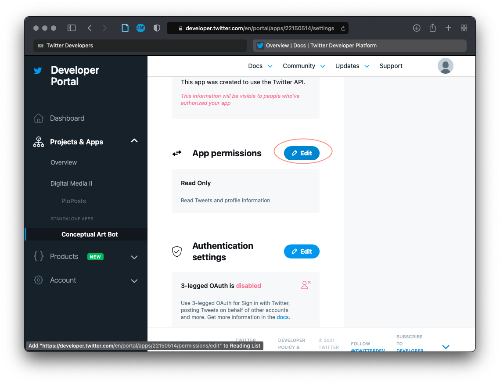
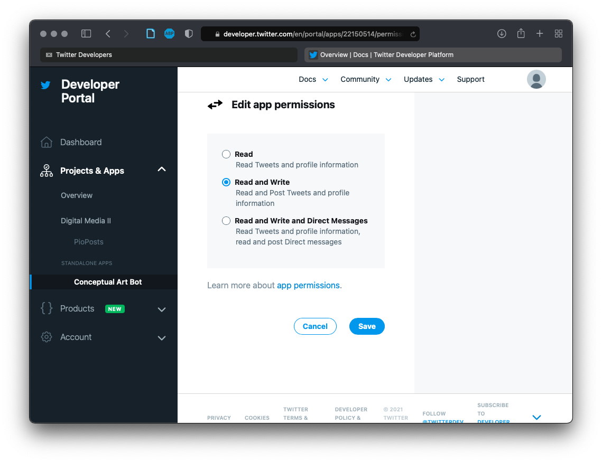
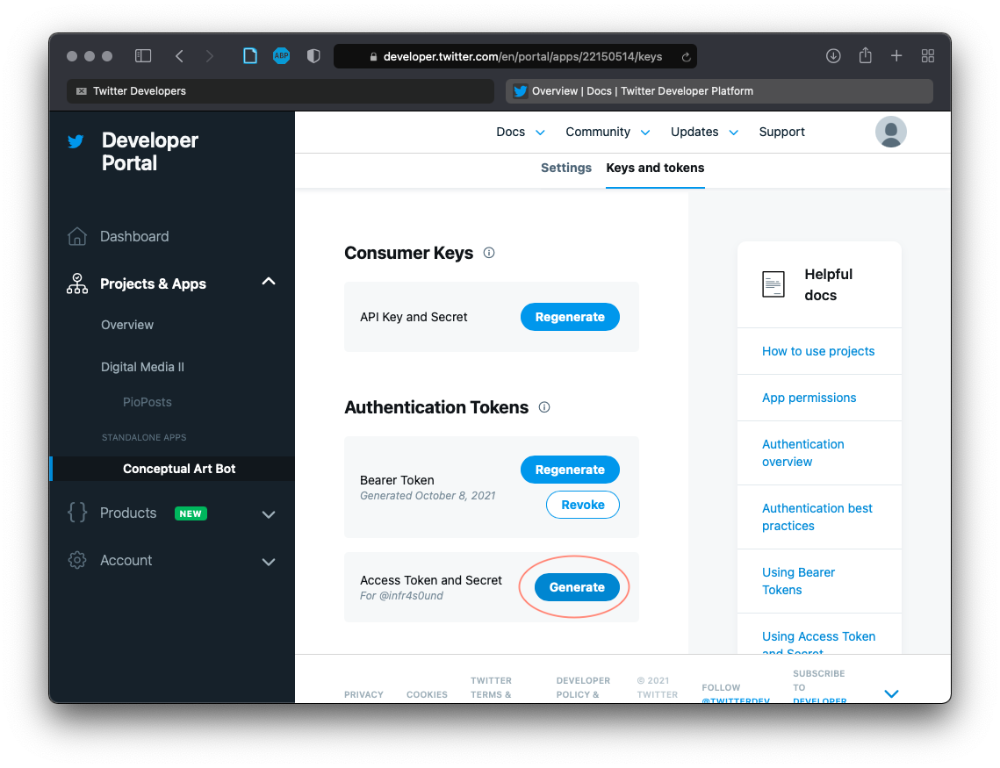
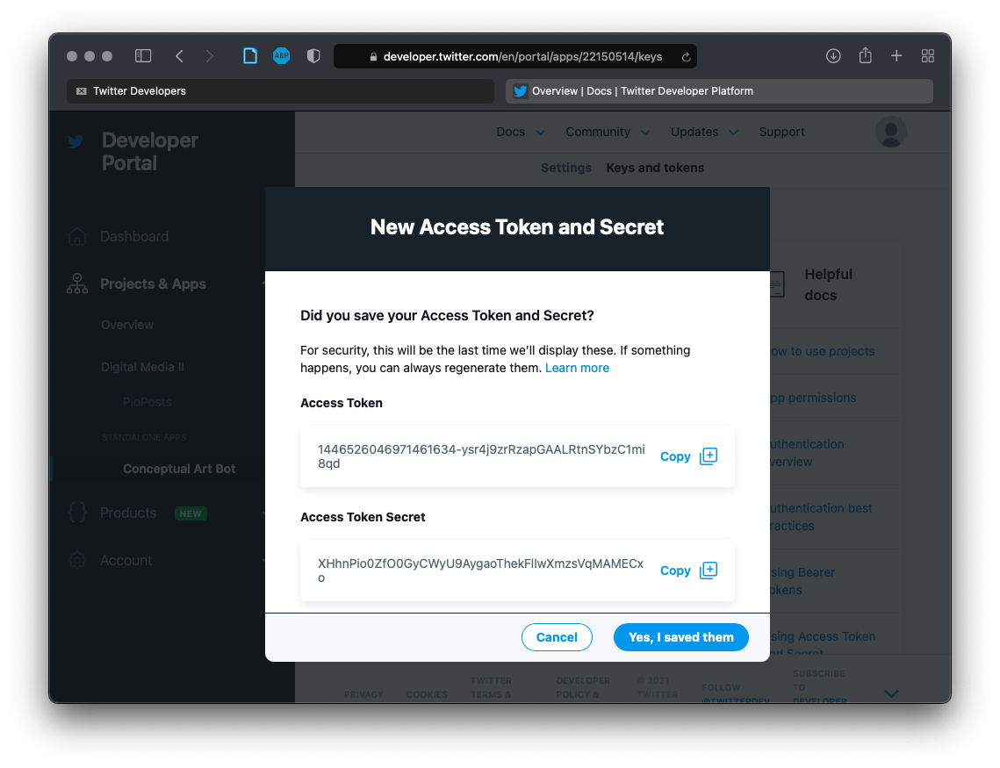
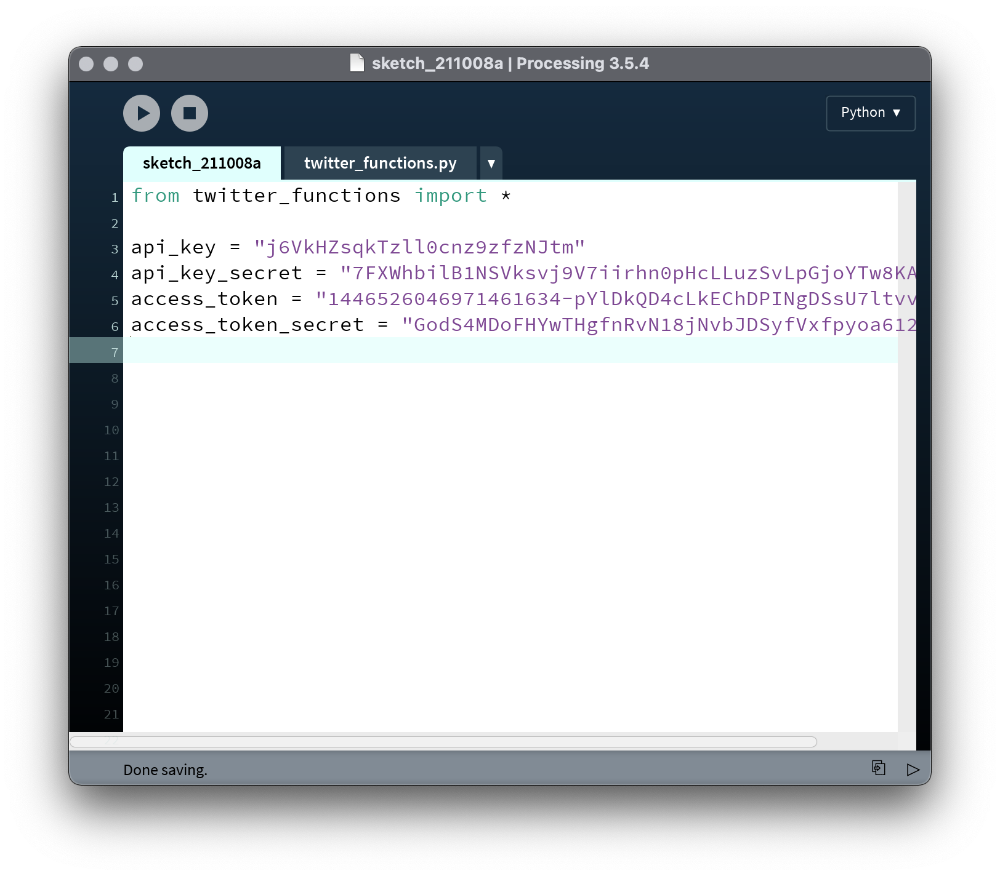

# Project #1: Social Automation

Much of the interaction that happens online is not between people, but between people and algorithms, or even between algorithms and algorithms. For example, huge platforms like Facebook, Google, and Twitter are constantly monitoring our activity and manipulating our feeds accordingly—and these platforms provide the environment for third-parties to attempt to game the system. From benign bots that tweet jokes to malicious fake followers that sow disinformation, we're not not alone out there.

For this project, you will create an experimental "Twitter Bot" using code. Your bot will maintain a presence online by automatically posting text and/or images, and it may interact socially by replying to others' comments. It may or may not be apparent to others that your bot is automated.

This is a 3-week project. This week you will present a proposal of your idea to the class for feedback. Next week, you will present your progress. The following week will be a crit. You must have an underlying artistic concept articulated with a 3-sentence artistic statement that you will present with the work.


## Tools

For this project, we'll be writing code in the Processing IDE and running it with Python using the Terminal or (Console for Windows). This is a similar setup to what we used for the "Nonlinearity" unit in Digital Media I. You may want to review how to get everything working:
- [get set up with Processing](https://github.com/brianhouse/ART112/blob/master/units/0_algorithm/getting_started.md)
- [using Python and the terminal/console](https://github.com/brianhouse/ART112/blob/master/units/4_nonlinearity/getting_started.md)

Additionally, we're going to need to need to add some modules to Python in order to interface with Twiter's API. API stands for Application Programming Interface, and it's a way that your computer will communication with Twitter's servers in order to control your bot without using the normal web interface.

To do this, open a terminal window. At the prompt ($), type:
```
$ python -m pip install TwitterAPI
```
You should see a stream of output as your computer downloads and installs various libraries. This should conclude with the line:
```
Successfully installed TwitterAPI-2.7.5
```
If not, get help, and we'll troubleshoot.

In addition, we're going to add some files to our Processing sketch before we begin. First, open a new sketch, and save it. Then, to add files, remember that you can use Processing's "Add File..." menu option:
<p align="center">
  
</p>

The first file to add is some code that I've written to help us get up and running faster. Download this and add it to your sketch:
- [twitter_functions.py](twitter_functions.py)

Secondly, we're going to be using text handling techniques similar to those from our "Recombination" unit in Digital Media I (review that [here](https://github.com/brianhouse/ART112/blob/master/units/5_recombination/lecture.md) if you need a reminder about strings and lists). To use these, we're going to want to have some word lists on hand:


- [list_stop_words.txt](https://github.com/brianhouse/ART112/blob/master/units/5_recombination/list_stop_words.txt)
- [list_adjectives.txt](https://github.com/brianhouse/ART112/blob/master/units/5_recombination/list_adjectives.txt)
- [list_interjections.txt](https://github.com/brianhouse/ART112/blob/master/units/5_recombination/list_interjections.txt)
- [list_nouns.txt](https://github.com/brianhouse/ART112/blob/master/units/5_recombination/list_nouns.txt)
- [list_prepositions.txt](https://github.com/brianhouse/ART112/blob/master/units/5_recombination/list_prepositions.txt)
- [list_pronouns.txt](https://github.com/brianhouse/ART112/blob/master/units/5_recombination/list_pronouns.txt)
- [list_verbs.txt](https://github.com/brianhouse/ART112/blob/master/units/5_recombination/list_verbs.txt)

Download and add each of these files to your sketch.

Once all of this is in place, type this line into your sketch, save it, and then run it on the command line (by typing `python ` into your terminal and then dragging the .pyde file to the terminal to get the path):

```py
from twitter_functions import *

```
You should see the output:
```
Successfully loaded Twitter functions
```
If you get an error instead, get help and we'll figure it out.


## Getting set up with Twitter

You'll need a [Twitter](https://twitter.com) account (even if you already have one, create a new one for this project). Sign up using your lclark.edu email address by clicking the "Sign up with Google" option. The Twitter handle you choose will be the name of your bot. Choose something now, but don't worry, you can change it later.

After you create an account, send me the handle so I can add you to our developer team. You should then receive an invite in your email. Accept the invite—you'll have to agree to terms and conditions, and then you'll be taken to the Twitter developer portal.

Next, you'll create a "Standalone App":

<p align="center">
  
</p>

Give your app a name:

<p align="center">
  
</p>

Click next, and you'll be shown a screen with some long key strings. We'll need to use the "API Key" and the "API Key Secret" in our program. Copy these two strings and paste them into your sketch as string variables:

<p align="center">
  
</p>

<p align="center">
  
</p>


After continuing to settings, and scroll down to "App Permissions". We need to change this to "Read and Write" in order to post tweets with our bots. Go ahead and make that change and save it:


<p align="center">
  
</p>

<p align="center">
  
</p>

Next, go to the tab "Keys and tokens". Under the "Authentication Tokens" section will be a button to generate an "Access Token and Secret":

<p align="center">
  
</p>

Click "Generate":

<p align="center">
  
</p>

<p align="center">
  
</p>

Once you've copied and pasted these strings into new variables in your sketch, go ahead and click "Yes, I saved them."

All of these settings and "tokens" and "secrets" are security measures to make sure that the app you're going to write is indeed authorized to make posts to Twitter and not some malicious virus taking over your account. It's a pain, but it's also important, and APIs other than Twitter will have their own similar procedures for getting set up. However, if all goes well here, we won't need to access any of this stuff again.


## Interfacing with Twitter

Now that we have everything set up "phew" we're ready to begin coding.

in tutorial first do post, then search, then retweet, then reply, then follow, then timeline, then post and download images


## References

Examples of artist-made bots:
- [Constant Dullart](https://www.constantdullaart.com/), [_The Possibility of Raising an Army_](http://army.cheap), article in the [Guardian](https://www.theguardian.com/artanddesign/2015/nov/09/army-for-hire-the-artist-employing-ghost-soldiers-to-invade-facebook-constant-dullaart)
- [Ramsey Nasser](https://nas.sr), [_Top Gun 555µhz_](https://nas.sr/555µhz/)
- [Darius Kazemi](http://tinysubversions.com)
    - https://twitter.com/BodegaBot
    - https://twitter.com/moonshotbot
    - https://twitter.com/WhichOneBot
    - https://twitter.com/rapnamebot
    - https://twitter.com/EatenBot
- [Everest Pipkin](https://everest-pipkin.com) and Loren Schmidt, [Moth Generator](https://twitter.com/mothgenerator)
- Allison Parrish, [Deep Question Bot](https://twitter.com/deepquestionbot)
- Brian House and [Kyle McDonald](http://kylemcdonald.net), [_Conversnitch_](https://brianhouse.net/works/conversnitch/)
- https://twitter.com/greatartbot
- https://twitter.com/tinycarebot
- https://twitter.com/infinite_scream


Artist writing about how to make a good bot:
- Harry Josephine Giles, "[Some Strategies of Bot Poetics](https://harryjosephine.com/2016/04/06/some-strategies-of-bot-poetics/)"
- Darius Kazemi, "[Basic Twitter Bot Etiquette](http://tinysubversions.com/2013/03/basic-twitter-bot-etiquette/)"
