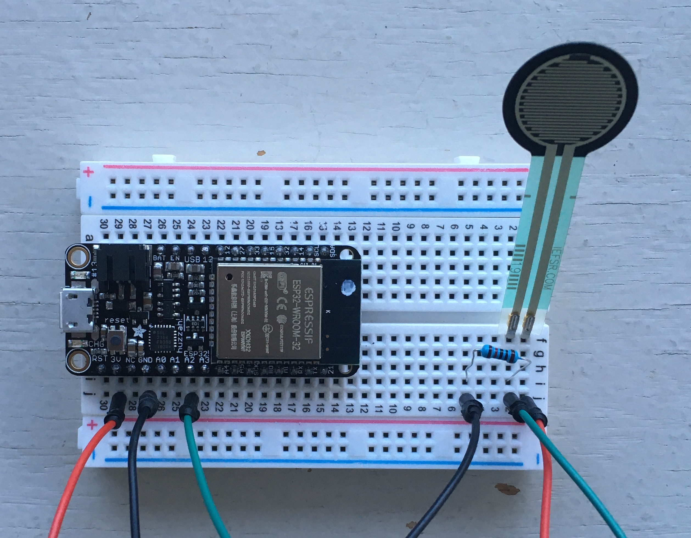
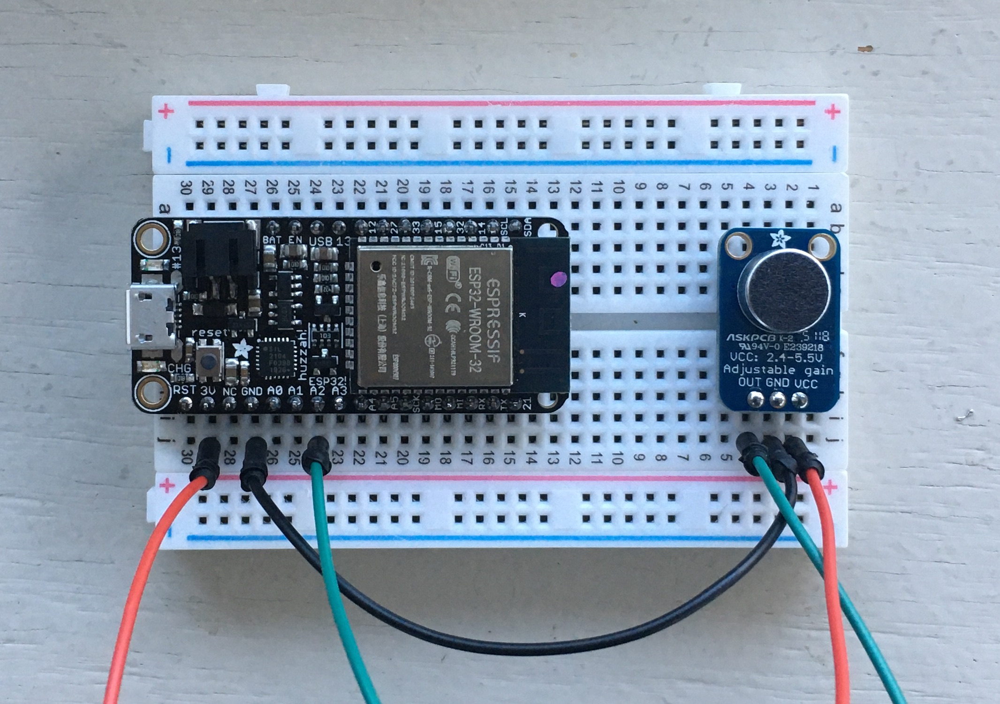

# Project #2: Poetic Sensing

As of 2020, there are [30 billion devices connected to the internet](https://www.statista.com/statistics/471264/iot-number-of-connected-devices-worldwide/), which far exceeds the human population. Most of these devices include sensors to capture data about the physical world, whether by monitoring the environment, surveilling people, or otherwise providing input to machines. While we may be largely unaware of their presence, these sensors and the systems of which they are a part end up shaping the world around us.

For this project, you will engage with sensor systems as an artistic medium. Choose some aspect of your physical environment and use a sensor to capture it—this could be as simple as how many times you sit at your desk, for example, or the amount of electromagnetic interference you pass during the day. These data will be transmitted to a server. Subsequently, you must interpret the data in some way, whether by visualizing it or using it to trigger some sort of action in the world.

To capture data, you will use a [ESP32 wireless microcontroller](https://www.espressif.com/en/products/hardware/esp32/overview) and the [Adafruit IO platform](https://io.adafruit.com). To interpret the data, you may program something yourself using [p5](https://p5js.org) or [node][https://nodejs.org], use [IFTTT](http://ifttt.com/)(If-This-Then-That, no programming required), or work with some other set of tools, including non-digital mediums.

This is a 3-week project that you will complete individually. This week you will present a proposal of your idea to the class for feedback. Next week, you will present your progress. The following week will be a crit. You must have an underlying artistic concept that you can articulate in a 3-sentence artistic statement that you will present with the work.


## Code

### Setup

To write code for our ESP32s, we will be using the Arduino IDE:

- Download and install the [ESP driver](https://www.silabs.com/products/development-tools/software/usb-to-uart-bridge-vcp-drivers)
- Download and install the [Arduino IDE](https://www.arduino.cc/en/main/software)
- Add the ESP32 libraries
    - Start the Arduino IDE and open Preferences window
    - In the "Additional Boards Manager URLs" enter `https://raw.githubusercontent.com/espressif/arduino-esp32/gh-pages/package_esp32_index.json`
    - Open Boards Manager from Tools > Board menu and install the esp32 platform by Espressif Systems
    - Select "Adafruit ESP32 Feather" ESP32 board from Tools > Board menu

The Adafruit IO platform provides us with a server:

- Sign up at https://io.adafruit.com
- Create a new "feed" called "sensor-test" and one called "battery"
- Note your AIO username and AIO key


### Wiring Sensors

The technical specs on the [Adafruit ESP32 Feather](https://learn.adafruit.com/adafruit-huzzah32-esp32-feather)

Sensor types (on hand):
- Button / switch
- Force-sensitive resistor (touch / pressure)
- Photocell (light-level)
- Tilt-switch (orientation)
- Vibration sensor
- Temperature (built-in)
- [Magnetic field (built-in)](https://randomnerdtutorials.com/esp32-hall-effect-sensor/)
- [Heartbeat](https://learn.adafruit.com/heart-rate-variability-sensor)
- [Sound level](https://learn.adafruit.com/adafruit-microphone-amplifier-breakout/assembly-and-wiring)

Others, to order:
- Humidity
- Galvanic skin response ("arousal")

- Water quality

#### FSR


#### Sound Level


### Arduino Templates

#### Basic Sensors
The following is a basic template for reporting a sensor value. This applies to FSRs, photocells, and motion sensors.
```c++
// load libraries
#include <WiFi.h>
#include <HTTPClient.h>

// add credentials
const char* WIFI_SSID = "LC Wireless";
const char* WIFI_PASS = "";
const String AIO_USERNAME = "";
const String AIO_KEY = "";
HTTPClient http;

// keep track of where the sensor is connected
const int SENSOR_PIN = A2;

// keep track of when we last checked the battery
unsigned long battery_check = 0;


void setup() {
  // start the serial connection and wait for it to open
  Serial.begin(115200);
  while(! Serial);
  // set up the LED, we'll use it to show when we're transmitting data
  pinMode(LED_BUILTIN, OUTPUT);
}


void loop() {

  // make sure we're connected and check the battery
  connectToWifi();
  checkBattery();

  // grab the current state of the sensor
  //int value = digitalRead(SENSOR_PIN); // use this if it's just a trigger
  int value = analogRead(SENSOR_PIN);   // use this if you want the actual value
  Serial.print("value -> ");
  Serial.println(value);

  // modify this condition to fit your application
  // if you remove the condition entirely, it will send every 2 seconds
  // (for digital reads, you probably don't need a condition)
  if (value > 10) {
    // if it's a relevant value, send it to AIO
    // paramters for sendData are the AIO feed-key and the numerical value
    sendData("sensor-test", value);
  }

  // include a short delay for the circuit to stabilize
  delay(50);

}


void connectToWifi() {
  if (WiFi.status() != WL_CONNECTED) {
    Serial.print("Connecting to wifi...");
    WiFi.begin(WIFI_SSID, WIFI_PASS);
    while (WiFi.status() != WL_CONNECTED) {
      delay(1000);
      Serial.print(".");
    }
    Serial.println();
    Serial.println("--> connected");
  }
}

void sendData(String feed, float datum) {  
  Serial.print("Sending data... ");
  digitalWrite(LED_BUILTIN, HIGH);  // turn the LED on
  String url = "https://io.adafruit.com/api/v2/" + AIO_USERNAME + "/feeds/" + feed + "/data";
  String object = "{\"X-AIO-Key\": \"" + AIO_KEY + "\", \"value\": " + datum + "}";
  http.begin(url);
  http.addHeader("Content-Type", "application/json");
  int httpResponseCode = http.POST(object);
  Serial.println(httpResponseCode);
  http.end();  
  delay(2000); // delay 2 seconds to avoid AIO rate limit
  digitalWrite(LED_BUILTIN, LOW);    // turn the LED off
}

void checkBattery() {
  unsigned long t = millis();
  if (battery_check == 0 || t - battery_check > 5 * 60 * 1000) {
    float voltage = ((analogRead(A13) * 2) / 4096.0) * 3.3;
    Serial.print("Battery at ");
    Serial.print(voltage);
    Serial.println("v");
    sendData("battery", voltage);   // report battery level every 5 minutes
    battery_check = t;
  }
}
```

#### Sound Level

This code sends a value when sound reaches above a certain threshold. For ambient sound level monitoring, set `window` to 1000 and take out the conditional around `sendData`.

```c
// load libraries
#include <WiFi.h>
#include <HTTPClient.h>

// add credentials
const char* WIFI_SSID = "LC Wireless";
const char* WIFI_PASS = "";
const String AIO_USERNAME = "";
const String AIO_KEY = "";
HTTPClient http;

// keep track of where the sensor is connected
const int SENSOR_PIN = A2;

// keep track of when we last checked the battery
unsigned long battery_check = 0;

// Sample window width in ms (50 ms = 20Hz, 1000 ms = 1hz)
const int window = 50;
unsigned int sample;

void setup() {
  // start the serial connection and wait for it to open
  Serial.begin(115200);
  while(! Serial);
  pinMode(LED_BUILTIN, OUTPUT);
}

void loop() {

    // make sure we're connected and check the battery
    connectToWifi();
    checkBattery();

    unsigned long start_time = millis();  // Start of sample window
    unsigned int peak = 0;
    unsigned int low = 4096;

    // gather samples over a window and find the peak
    while (millis() - start_time < window) {
        sample = analogRead(SENSOR_PIN);
        if (sample < 4095) {      // ignore high signal glitches
          if (sample > peak) {
            peak = sample;
          } else if (sample < low) {
            low = sample;          
          }
        }
    }
    float level = 100 * ((peak - low) / 4096.0);
    Serial.println(level);

    // if it's a relevant value, send it to AIO
    if (level > 5) {
      sendData("sound-level", level);
    }

}

void connectToWifi() {
  if (WiFi.status() != WL_CONNECTED) {
    Serial.print("Connecting to wifi...");
    WiFi.begin(WIFI_SSID, WIFI_PASS);
    while (WiFi.status() != WL_CONNECTED) {
      delay(1000);
      Serial.print(".");
    }
    Serial.println();
    Serial.println("--> connected");
  }
}


void sendData(String feed, float datum) {  
  Serial.print("Sending data... ");
  digitalWrite(LED_BUILTIN, HIGH);  
  String url = "https://io.adafruit.com/api/v2/" + AIO_USERNAME + "/feeds/" + feed + "/data";
  String object = "{\"X-AIO-Key\": \"" + AIO_KEY + "\", \"value\": " + datum + "}";
  http.begin(url);
  http.addHeader("Content-Type", "application/json");
  int httpResponseCode = http.POST(object);
  Serial.println(httpResponseCode);
  http.end();  
  delay(2000); // delay 2 seconds to avoid AIO rate limit
  digitalWrite(LED_BUILTIN, LOW);  
}

void checkBattery() {
  unsigned long t = millis();
  if (battery_check == 0 || t - battery_check > 5 * 60 * 1000) {
    float voltage = ((analogRead(A13) * 2) / 4096.0) * 3.3;
    Serial.print("Battery at ");
    Serial.print(voltage);
    Serial.println("v");
    sendData("battery", voltage);   // report battery level every 5 minutes
    battery_check = t;
  }
}
```

#### Temperature and Humidity

This variation works with the DHT11 (blue) breakout boards. You'll also need to install the Adafruit DHT Sensor Library and Adafruit Unified Sensor Library through the Arduino IDE library manager. Connect the "out" pin from the sensor to pin 33 on your ESP32.

```c
// REQUIRES the DHT Sensor Library and Adafruit Unified Sensor Library

// load libraries
#include <WiFi.h>
#include <HTTPClient.h>
#include "DHT.h"
#define DHTTYPE DHT11
#define DHTPIN 33       // Digital pin connected to the DHT sensor

// add credentials
const char* WIFI_SSID = "LC Wireless";
const char* WIFI_PASS = "";
const String AIO_USERNAME = "";
const String AIO_KEY = "";

HTTPClient http;
DHT dht(DHTPIN, DHTTYPE);

// keep track of when we last checked the battery
unsigned long battery_check = 0;


void setup() {
  // start the serial connection and wait for it to open
  Serial.begin(115200);
  while(! Serial);
  // set up the LED, we'll use it to show when we're transmitting data
  pinMode(LED_BUILTIN, OUTPUT);
  dht.begin();
}


void loop() {

  // make sure we're connected and check the battery
  connectToWifi();
  checkBattery();

  float h = dht.readHumidity();
  float t = dht.readTemperature(true);
  if (isnan(h) || isnan(t)) {
    Serial.println(F("Failed to read from DHT sensor!"));
    return;
  }
  Serial.print(F("Humidity: "));
  Serial.println(h);
  Serial.print(F("%  Temperature: "));
  Serial.println(t);

  sendData("humidity", h);
  sendData("temperature", t);

  // delay for a minute
  delay(60 * 1000);

}


void connectToWifi() {
  if (WiFi.status() != WL_CONNECTED) {
    Serial.print("Connecting to wifi...");
    WiFi.begin(WIFI_SSID, WIFI_PASS);
    while (WiFi.status() != WL_CONNECTED) {
      delay(1000);
      Serial.print(".");
    }
    Serial.println();
    Serial.println("--> connected");
  }
}

void sendData(String feed, float datum) {  
  Serial.print("Sending data... ");
  digitalWrite(LED_BUILTIN, HIGH);  // turn the LED on
  String url = "https://io.adafruit.com/api/v2/" + AIO_USERNAME + "/feeds/" + feed + "/data";
  String object = "{\"X-AIO-Key\": \"" + AIO_KEY + "\", \"value\": " + datum + "}";
  http.begin(url);
  http.addHeader("Content-Type", "application/json");
  int httpResponseCode = http.POST(object);
  Serial.println(httpResponseCode);
  http.end();  
  delay(2000); // delay 2 seconds to avoid AIO rate limit
  digitalWrite(LED_BUILTIN, LOW);    // turn the LED off
}

void checkBattery() {
  unsigned long t = millis();
  if (battery_check == 0 || t - battery_check > 5 * 60 * 1000) {
    float voltage = ((analogRead(A13) * 2) / 4096.0) * 3.3;
    Serial.print("Battery at ");
    Serial.print(voltage);
    Serial.println("v");
    sendData("battery", voltage);   // report battery level every 5 minutes
    battery_check = t;
  }
}

```


### p5 Template (Data Visualization)

```js
const AIO_USERNAME = "h0use"
const AIO_KEY = "2507ddf88a73494884935ca76ed2ae0e"

function setup() {
    let canvas = createCanvas(640, 480)
    noLoop()
}

async function draw() { // note "async" keyword

    // fetch our data
    let data = await fetchData("sensor-test")      // note the "await" keyword
    print(data)

    // re-sort the array by time
    data.sort((a, b) => (a.created_at > b.created_at) ? 1 : -1)

    // make a new array with just the sensor values
    // divide by the max value to "normalize" them to the range 0-1
    let values = []
    for (let datum of data) {
        values.push(datum.value / 4095)
    }

    // make a new array with just the timestamp
    // this one is trickier to normalize so we'll do it separately
    let times = []
    for (let datum of data) {
        // convert the string into a numerical timestamp
        let time = Date.parse(datum.created_at) / 1000
        times.push(time)
    }

    // normalize the times to between 0 and 1
    let start_time = min(times)
    let stop_time = max(times)
    for (let i=0; i<times.length; i++) {
        let time = times[i]
        times[i] = (time - start_time) / (stop_time - start_time)
    }

    // now we can draw

    background(255)

    // make colors
    // in this case, we want a line every pixel, and to interpolate between values
    // colorMode(HSB) // https://p5js.org/reference/#/p5/colorMode
    for (let i=1; i<values.length; i++) {
        let x1 = int(times[i-1] * width)
        let x2 = int(times[i] * width)
        print(x1, x2)
        let c1 = color(55, values[i-1] * 255, 255)
        let c2 = color(55, values[i] * 255, 255)
        for (let x=x1; x<=x2; x++) {
            let interpolation = (x-x1) / (x2-x1)
            print(x, interpolation)
            let c = lerpColor(c1, c2, interpolation)
            stroke(c)
            line(x, 0, x, height)
        }
    }

    // this one is just a breakpoint line, similar to the adafruit feed page
    // note that to get the y axis right, we have to flip it by subtracting from 1
    stroke(0)
    strokeWeight(2)
    for (let i=1; i<values.length; i++) {   // starting at 1, not 0
        let x1 = times[i-1] * width
        let y1 = (1 - values[i-1]) * height
        let x2 = times[i] * width
        let y2 = (1 - values[i]) * height
        line(x1, y1, x2, y2)
    }

}

// this function fetches our data
async function fetchData(feed) {
    return await new Promise((resolve, reject) => {
        let url = `https://io.adafruit.com/api/v2/${AIO_USERNAME}/feeds/${feed}/data`
        httpGet(url, 'json', false, function(data) {
            resolve(data)
        })
    })
}
```


### Node Template

```js
const request = require('request') // install with "npm install request"
const print = console.log

const AIO_USERNAME = "h0use"
const AIO_KEY = "2507ddf88a73494884935ca76ed2ae0e"

// helper function to fetch a feed
async function fetchData(feed) {
    return await new Promise((resolve, reject) => {
        let url = `https://io.adafruit.com/api/v2/${AIO_USERNAME}/feeds/${feed}/data`
        request(url, {json: true}, (error, response, body) => {
            resolve(body)
        })
    })
}

// do stuff in here
async function main() {

    let results = await fetchData("sensor-test")    // note: await
    print(results)

    for (let result of results) {
        print(result)
    }

}

main()
```


## Conceptual References
- [Nathalie Miebach](https://nathaliemiebach.com) (weather data)
- [Karolina Sobecka](http://cargocollective.com/karolinasobecka/filter/matterOfAir/Puff) (car exhaust)
- [Georgia Lupi](http://giorgialupi.com) (hand-drawn data visualization)
- [Martin Howse](http://www.1010.co.uk/org/radiomycelium.html) (mycelium)
- [Afroditi Psarra](http://afroditipsarra.com/index.php?/older-projects/cosmic-bitcasting/) (cosmic rays)
- [Jer Thorp](http://jerthorp.com/) (data visualization)
- [Ali Momeni](http://alimomeni.net/gutwise) (the gut)
- [Brian House](https://brianhouse.net/works/animas/) (water quality)
- [Chris Woebken](https://chriswoebken.com/Amphibious-Architecture) (fish)
- [Timo Toots](https://www.timo.ee/psa/) (ants)
