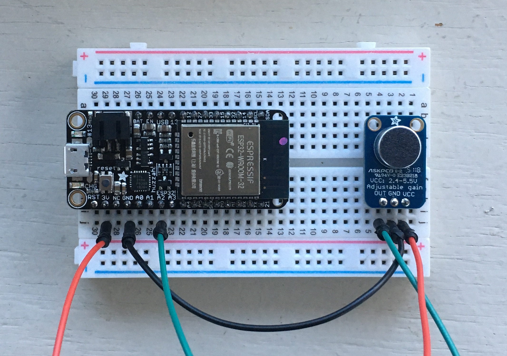

# Project #2: Poetic Sensing

As of 2020, there are [30 billion devices connected to the internet](https://www.statista.com/statistics/471264/iot-number-of-connected-devices-worldwide/), which far exceeds the human population. Most of these devices include sensors to capture data about the physical world, whether by monitoring the environment, surveilling people, or otherwise providing input to machines. While we may be largely unaware of their presence, these sensors and the systems of which they are a part end up shaping the world around us.

For this project, you will engage with sensor systems as an artistic medium. Choose some aspect of your physical environment and use a sensor to capture it—this could be as simple as how many times you sit at your desk, for example, or the amount of electromagnetic interference you pass during the day. These data will be transmitted to a server. Subsequently, you must interpret the data in some way, whether by visualizing it or connecting it to some other action in the world.

To capture data, you will use a [ESP32 wireless microcontroller](https://www.espressif.com/en/products/hardware/esp32/overview) and the [Adafruit IO platform](https://io.adafruit.com). You can use Python for Processing to interpret the data, or some other platform if you prefer.

This is a 3-week project. Next week you will present a proposal of your idea to the class for feedback, and you will present your progress. The following week will be a crit. You must have a title and an underlying artistic concept articulated with a [3-sentence description](../../resources/description_guidelines.md) that you will present with the work.

For your proposal, turn in a draft version of your title and description. Also include any references to fully explain your thinking.

## Conceptual References
- [Nathalie Miebach](https://nathaliemiebach.com) (weather data)
- [Karolina Sobecka](http://cargocollective.com/karolinasobecka/filter/matterOfAir/Puff) (car exhaust)
- [Jer Thorp](https://www.jerthorp.com/herald-harbinger)
- [Georgia Lupi](http://giorgialupi.com) (hand-drawn data visualization)
- [Martin Howse](http://www.1010.co.uk/org/radiomycelium.html) (mycelium)
- [Afroditi Psarra](http://afroditipsarra.com/index.php?/older-projects/cosmic-bitcasting/) (cosmic rays)
- [Ali Momeni](http://alimomeni.net/gutwise) (the gut)
- [Brian House](https://brianhouse.net/works/animas/) (water quality)
- [Chris Woebken](https://chriswoebken.com/Amphibious-Architecture) (fish)
- [Timo Toots](https://www.timo.ee/psa/) (ants)


## Code (and Wiring)

### Setup

To write code for our ESP32s, we will be using Micropython via the Thonny IDE.

##### Driver

First, we have to download and install the [ESP driver](https://www.silabs.com/products/development-tools/software/usb-to-uart-bridge-vcp-drivers) that will allow your machine to communicate with your ESP over a USB port.

When this is finished installing, restart your machine, and then plug in your ESP.

##### Thonny

Next, download and install the [Thonny IDE](https://thonny.org). After opening the program, go to `Tools > Options` and choose `Interpreter`. Choose "MicroPython (ESP32)" for the interpreter, and find the UART Bridge Controller under "Port":

<p align="center">
  
</p>

You will need to have your ESP plugged in for this to work. After you've closed the dialog box, click the "Stop/Restart" stop sign button. In the console, you should see something like:
```
MicroPython v1.18 on 2022-01-17; ESP32 module with ESP32
Type "help()" for more information.
>>>
```

In addition, we need to install the `urequests` and `ujson` packages. Go to `Tools > Manage Packages`. Search for `urequests` and install the first option. Do this with `ujson` as well (note that `ujson` will not show up in the left column as an installed package).

Finally, go to [esp_helper.py](esp/helper.py) and copy the contents. Open Thonny and make a new file, and paste the contents into this file. Then choose `File > Save`, and select `MicroPython device`. Title the file `esp_helper.py` and save it. Once you've done this, close the file.

##### AIO

The Adafruit IO platform provides us with a server:

- Sign up at https://io.adafruit.com
- Create a new "feed" called "hall-sensor" and one called "battery"
- Note your AIO username and AIO key under "My Key"

Back in Thonny, in a new file (or the untitled file showing on the interface), paste your credentials, as well as the wifi info:
```py
SSID = "LC Wireless"
PASS = ""
AIO_USERNAME = "h0use"
AIO_KEY = "XXXXXXXXXXXXXXXXXXXXXXXXXXXXXXXX"
```
Save this file as `credentials.py` to `MicroPython device` (your ESP).

##### Testing

Create a new file containing the following, and save it on your ESP:

```py
from esp_helper import *

while True:
    # connect_wifi()
    hall = esp32.hall_sensor()
    print(hall)
    # post_data("hall-sensor", hall)
```

The hall sensor is a built-in sensor on the ESP which detects magnetic fields. This code will read data from the sensor and print it to console. Run it by clicking the green triangle. You should see a stream of numbers in the console ("Shell"). If you choose `View > Plotter`, you should see a constantly changing graph:

<p align="center">
  
</p>

Now, by uncommenting the lines `connect_wifi()` and `post_data("hall-sensor", hall)`, you will be posting this data to your AIO feed. Do this, and save the file (you will have to click the stop sign before Thonny will be able to copy over the changed file).

Your sensor will now be running much slower (in part to avoid AIO's rate limits):

<p align="center">
  
</p>

Congratulations! You've made a remote sensor. Go back to your feed on AIO, and you should see new data coming in.

Note that this code is running on the ESP, not your computer—if you hook it up to a battery and disconnect it from your computer, it will still work.

Going forward, our basic code template will look like this:

```py
from esp_helper import *    # import esp functions

while True:                 # infinite loop
    connect_wifi()          # connect to wifi
    check_battery()         # check the battery level and log it

    # read a sensor and divide by the maximum value
    # result is a float between 0 and 1
    value = A2.read() / 4096.0  
    sleep(.1)  # include a short delay for stability
    print(value)

    # send to AIO
    post_data("my-sensor", value)
```
The specifics of how the sensor is read may vary slightly between sensors, and are indicated below.


### Sensors

The sensors at your disposal are the following:

- [Light level (photocell)](#photo)
- [Contact (FSR)](#fsr)
- [Temperature and humidity](#temp)
- [Motion](#motion)
- [Sound level](#sound)
- [Heartrate](#heart)
- [Touch](#touch)

The job of the microcontroller is to provide a voltage to the sensor, take a reading, and then transmit the result over the network.

To provide voltage to the sensor, you'll need to connect the sensor to the 3.3v pin on the microcontroller, and also to ground (electricity always flows in a "circuit"—out from the source and then back to the ground).

To take a reading, you'll use the A2, A3, A4, D32, or D33 pins on the microcontroller (the others have various other functionality attached to them and may not work initially as expected) along with a resistor or some other component that helps regulate and scale the sensor's output to something the chip can read.

In order to simply the process of hooking things up, we'll use breadboards.

Sensors can break, but overall the ESP is pretty resilient. **The one thing you should not do is connect 3.3v to another pin or to ground without anything in between.**

#### <a name="photo"></a> Light (photocell)

A photocell measures the light level. Hook it up with 2.2k resistor.

Product: https://www.adafruit.com/product/161


Code:
```py
    value = A2.read() / 4096.0  
    sleep(.1)
```

#### <a name="fsr"></a> Contact (FSR)

Force-sensitive resistors measure contact. Requires a 10k Ohm resistor.

Product: https://www.adafruit.com/product/166


Code:
```py
    value = A2.read() / 4096.0  
    sleep(.1)
```

#### <a name="temp"></a> Temperature and Humidity

Temperature and humidity with one sensor via a digital input. Use a 10k Ohm resistor.

Product: https://www.adafruit.com/product/386


Code:
```py
    sensor = DHT11(D32)
    sensor.measure()
    temp = sensor.temperature() * 1.8 + 32  # convert to F
    humidity = sensor.humidity()
    print(f"{temp}°F")
    print(f"{humidity}%")
    sleep(2)
```


#### <a name="motion"></a> Motion

Ultrasonic range finder! Detects if something is in front of it, from 6 inches to about 20 feet, at a resolution of about an inch.

Product: https://www.adafruit.com/product/172


Code:
```py
from esp_helper import *

smoother = Smoother(3)   # create a smoother (running averager)

while True:
    # convert sensor reading to feet
    value = (((A2.read() / 4096.0) * 248) + 12) / 12.0
    # smooth out subsequent values
    value = smoother.smooth(value)
    print(value)    
    sleep(.1)

    # trigger something if detects presence closer than 3 ft
    if value < 3:
        print("Closer than 3 ft!")
```
A more complete example is shown for this sensor which uses a smoother and a threshold. Smoothing simply takes subsequent values and averages them—a `Smoother(factor)` must be created outside of the main loop with a number that indicates over how many values to average. We can then use `smoother.smooth(value)` to smooth the readings as we go.

Some additional math is used to convert the sensor reading to feet. This makes it simple to make something like a threshold that detects if something is present within a given distance.

#### <a name="sound"></a> Sound level

You can monitor sound level with the MAX9814. This setup sends a value when sound reaches above a certain threshold. For ambient sound level monitoring, set `window` to 1000 and take out the conditional around `sendData` in the code.

Product: https://www.adafruit.com/product/1713
-- use an FFT driver?



#### <a name="heart"></a> Heart rate

Product: https://www.adafruit.com/product/1093

https://www.mfitzp.com/invent/wemos-heart-rate-sensor-display-micropython/

This sensor works best when the back is covered by something opaque like a piece of electrical tape, and try putting it on your earlobe—read the online guides at [PulseSensor.com](http://PulseSensor.com). You will need to install the PulseSensor Playground library through the Arduino IDE library manager. Look at the live data using the Serial Plotter; this code reports a BPM every minute.


#### <a name="touch"></a> Touch

- touch
(built-in)
