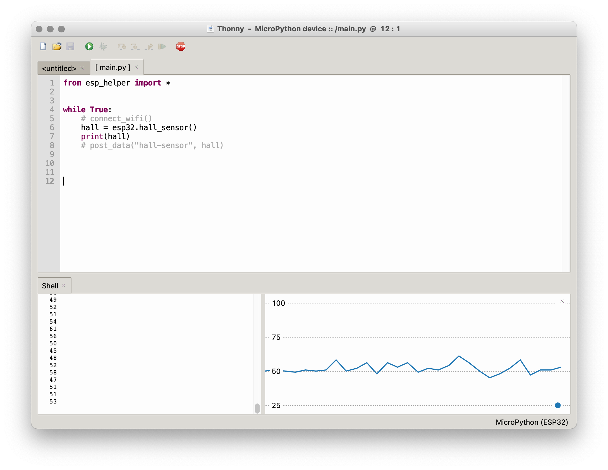

# Project #2: Poetic Sensing

As of 2020, there are [30 billion devices connected to the internet](https://www.statista.com/statistics/471264/iot-number-of-connected-devices-worldwide/), which far exceeds the human population. Most of these devices include sensors to capture data about the physical world, whether by monitoring the environment, surveilling people, or otherwise providing input to machines. While we may be largely unaware of their presence, these sensors and the systems of which they are a part end up shaping the world around us.

For this project, you will engage with sensor systems as an artistic medium. Choose some aspect of your physical environment and use a sensor to capture it—this could be as simple as how many times you sit at your desk, for example, or the amount of electromagnetic interference you pass during the day. These data will be transmitted to a server. Subsequently, you must interpret the data in some way, whether by visualizing it or connecting it to some other action in the world.

To capture data, you will use a [ESP32 wireless microcontroller](https://www.espressif.com/en/products/hardware/esp32/overview) and the [Adafruit IO platform](https://io.adafruit.com). You can use Python for Processing to interpret the data, or some other platform if you prefer.

This is a 3-week project. Next week you will present a proposal of your idea to the class for feedback, and you will present your progress. The following week will be a crit. You must have a title and an underlying artistic concept articulated with a [3-sentence description](../../resources/description_guidelines.md) that you will present with the work.

For your proposal, turn in a draft version of your title and description. Also include any references to fully explain your thinking.

## Conceptual References
- [Nathalie Miebach](https://nathaliemiebach.com) (weather data)
- [Karolina Sobecka](http://cargocollective.com/karolinasobecka/filter/matterOfAir/Puff) (car exhaust)
- [Georgia Lupi](http://giorgialupi.com) (hand-drawn data visualization)
- [Martin Howse](http://www.1010.co.uk/org/radiomycelium.html) (mycelium)
- [Afroditi Psarra](http://afroditipsarra.com/index.php?/older-projects/cosmic-bitcasting/) (cosmic rays)
- [Jer Thorp](http://jerthorp.com/) (data visualization)
- [Ali Momeni](http://alimomeni.net/gutwise) (the gut)
- [Brian House](https://brianhouse.net/works/animas/) (water quality)
- [Chris Woebken](https://chriswoebken.com/Amphibious-Architecture) (fish)
- [Timo Toots](https://www.timo.ee/psa/) (ants)


## Code (and Wiring)

### Setup

To write code for our ESP32s, we will be using Micropython on the Thonny IDE.

##### Driver

First, we have to download and install the [ESP driver](https://www.silabs.com/products/development-tools/software/usb-to-uart-bridge-vcp-drivers) that will allow your machine to communicate with your ESP over a USB port.

When this is finished installing, restart your machine, and then plug in your ESP.

##### Thonny

Next, download and install the [Thonny IDE](https://thonny.org). After opening the program, go to `Tools > Options` and choose `Interpreter`. Choose "MicroPython (ESP32)" for the interpreter, and find the UART Bridge Controller under "Port":

<p align="center">
  
</p>

You will need to have your ESP plugged in for this to work. After you've closed the dialog box, click the "Stop/Restart" stop sign button. In the console, you should see something like:
```
MicroPython v1.18 on 2022-01-17; ESP32 module with ESP32
Type "help()" for more information.
>>>
```

In addition, we need to install the `urequests` and `ujson` packages. Go to `Tools > Manage Packages`. Search for `urequests` and install the first option. Do this with `ujson` as well (note that `ujson` will not show up in the left column as an installed package).

Finally, download [esp_helper.py](esp/helper.py). Open this in Thonny. Then choose `File > Save copy...`, and select `MicroPython device`. Title the file `esp_helper.py` and save it. Once you've done this, close the file.

##### AIO

The Adafruit IO platform provides us with a server:

- Sign up at https://io.adafruit.com
- Create a new "feed" called "hall-sensor" and one called "battery"
- Note your AIO username and AIO key under "My Key"

Back in Thonny, in the untitled file showing on the interface, paste your credentials, as well as the wifi info:
```py
SSID = "LC Wireless"
PASS = ""
AIO_USERNAME = "h0use"
AIO_KEY = "XXXXXXXXXXXXXXXXXXXXXXXXXXXXXXXX"
```
Save this file as `credentials.py` to `MicroPython device` (your ESP).

##### Testing

Create a new file containing the following, and save it on your ESP:

```py
from esp_helper import *

# connect_wifi()

while True:
    hall = esp32.hall_sensor()
    print(hall)
    # post_data("hall-sensor", hall)
```

The hall sensor is a built-in sensor on the ESP which detects magnetic fields. This code will read data from the sensor and print it to console. Run it by clicking the green triangle. You should see a stream of numbers in the console ("Shell"). If you choose `View > Plotter`, you should see a constantly changing graph:

<p align="center">
  
</p>

Now, by uncommenting the lines `connect_wifi()` and `post_data("hall-sensor", hall)`, you will be posting this data to your AIO feed. Do this, and save the file (you will have to click the stop sign before Thonny will be able to copy over the changed file).

Your sensor will now be running much slower (in part to avoid AIO's rate limits):

<p align="center">
  
</p>

Congratulations! You've made a remote sensor. Go back to your feed on AIO, and you should see new data coming in.

Note that this code is running on the ESP, not your computer—if you hook it up to a battery and disconnect it from your computer, it will still work.


### Sensors

The technical specs on the [Adafruit ESP32 Feather](https://learn.adafruit.com/adafruit-huzzah32-esp32-feather)

Use A2, A3, and A4 for analog inputs and 32 and 33 for GPIOs. The other pins have various other functionality attached to them and may not work initially as expected.


The following is a basic template for reporting a sensor value. This applies to force-sensitive resistors (bending or touching), photocells (light level), and motion sensors (presence). You will also need a 10k Ohm resistor.

##### Arduino Template
[basic.ino](basic.ino)

##### Wiring


### Sound Level

You can monitor sound level with the [MAX9814](https://www.adafruit.com/product/1713). This setup sends a value when sound reaches above a certain threshold. For ambient sound level monitoring, set `window` to 1000 and take out the conditional around `sendData` in the code.

##### Arduino Template
[sound_level.ino](sound_level.ino)

##### Wiring


### Temperature and Humidity

This variation works with [DHT11 (blue) breakout boards](https://www.amazon.com/HiLetgo-Temperature-Humidity-Digital-3-3V-5V/dp/B01DKC2GQ0/ref=sr_1_4?crid=29K0T2RXDWMKE&dchild=1&keywords=dht11+temperature+and+humidity+sensor&qid=1582840745&sprefix=DHT11%2Caps%2C204&sr=8-4). You'll also need to install the "Adafruit DHT Sensor" library and "Adafruit Unified Sensor" library through the Arduino IDE library manager (make sure these titles match exactly—there are a lot of similarly named modules). Connect the "out" pin from the sensor to pin 33 on your ESP32.

##### Arduino Template
[temp.ino](temp.ino)

##### Wiring


### Heart Rate

A [Pulse Sensor](https://www.adafruit.com/product/1093) can be used to monitor your heart rate. Note that the sensor works best when the back is covered by something opaque like a piece of electrical tape, and try putting it on your earlobe—read the online guides at [PulseSensor.com](http://PulseSensor.com). You will need to install the PulseSensor Playground library through the Arduino IDE library manager. Look at the live data using the Serial Plotter; this code reports a BPM every minute.

##### Arduino Template
[pulse.ino](pulse.ino)


##### Wiring


### p5 Template (Data Visualization)

You will need to make your feed public to retrieve the data using javascript.

```js
const AIO_USERNAME = ""
const AIO_KEY = ""

let values = []
let times = []

let index = 0

function setup() {

    let canvas = createCanvas(640, 480)
    canvas.parent('p5')

    // fetch our data
    let feed = 'sound-level'
    let url = `https://io.adafruit.com/api/v2/${AIO_USERNAME}/feeds/${feed}/data`
    httpGet(url, 'json', false, function(data) {

        print(data)
        // re-sort the array by time
        data.sort((a, b) => (a.created_at > b.created_at) ? 1 : -1)

        // make a new array with just the sensor values
        // divide by the max value to "normalize" them to the range 0-1
        for (let datum of data) {
            values.push(datum.value / 4095)
        }

        // make a new array with just the timestamp
        // this one is trickier to normalize so we'll do it separately
        for (let datum of data) {
            // convert the string into a numerical timestamp
            let time = Date.parse(datum.created_at) / 1000
            times.push(time)
        }

        // normalize the times to between 0 and 1
        let start_time = min(times)
        let stop_time = max(times)
        for (let i=0; i<times.length; i++) {
            let time = times[i]
            times[i] = (time - start_time) / (stop_time - start_time)
        }

    })

}

function draw() {

    background(255)

    // make colors
    // in this case, we want a line every pixel, and to interpolate between values
    // colorMode(HSB) // https://p5js.org/reference/#/p5/colorMode
    for (let i=1; i<values.length; i++) {
        let x1 = int(times[i-1] * width)
        let x2 = int(times[i] * width)
        print(x1, x2)
        let c1 = color(55, values[i-1] * 255, 255)
        let c2 = color(55, values[i] * 255, 255)
        for (let x=x1; x<=x2; x++) {
            let interpolation = (x-x1) / (x2-x1)
            print(x, interpolation)
            let c = lerpColor(c1, c2, interpolation)
            stroke(c)
            line(x, 0, x, height)
        }
    }

    // this one is just a breakpoint line, similar to the adafruit feed page
    // note that to get the y axis right, we have to flip it by subtracting from 1
    stroke(0)
    strokeWeight(2)
    for (let i=1; i<values.length; i++) {   // starting at 1, not 0
        let x1 = times[i-1] * width
        let y1 = (1 - values[i-1]) * height
        let x2 = times[i] * width
        let y2 = (1 - values[i]) * height
        line(x1, y1, x2, y2)
    }

    // try an animation
    circle(times[index] * width, (1 - values[index]) * height, 50)
    index += 1
    if (index == times.length) {
        index = 0
    }

}
```


### Node Template

You will need to make your feed public to retrieve the data using javascript.

```js
const request = require('request') // install with "npm install request"
const print = console.log

const AIO_USERNAME = "h0use"
const AIO_KEY = "2507ddf88a73494884935ca76ed2ae0e"

// helper function to fetch a feed
async function fetchData(feed) {
    return await new Promise((resolve, reject) => {
        let url = `https://io.adafruit.com/api/v2/${AIO_USERNAME}/feeds/${feed}/data`
        request(url, {json: true}, (error, response, body) => {
            resolve(body)
        })
    })
}

// do stuff in here
async function main() {

    let results = await fetchData("sensor-test")    // note: await
    print(results)

    for (let result of results) {
        print(result)
    }

}

main()
```
