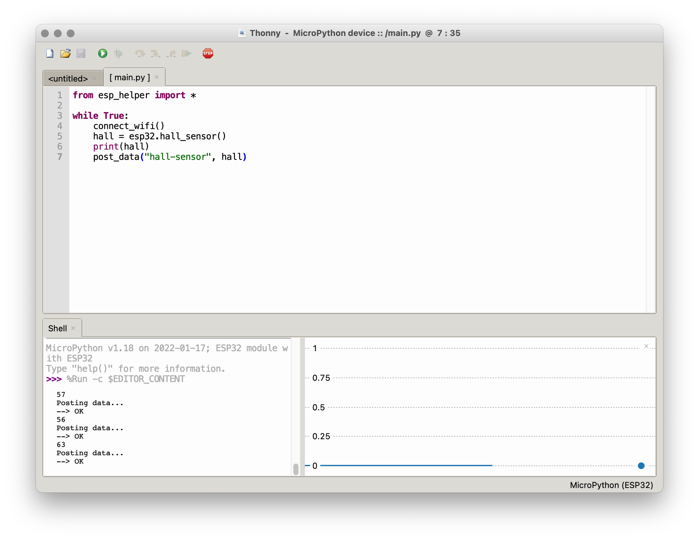

# Basic Microcontrollers

- [Setup](#setup)
- [Sensors](#sensors)
<!-- - [Interface](#interface) -->
<!-- - [Outputs](#outputs) -->


## <a name="setup"></a> Setup

#### Software and Drivers

To write code for our ESP32s, we will be using Micropython via the Thonny IDE.

##### Driver

First, we have to download and install the [ESP driver](https://www.silabs.com/products/development-tools/software/usb-to-uart-bridge-vcp-drivers) that will allow your machine to communicate with your ESP over a USB port.

When this is finished installing, restart your machine, and then plug in your ESP.

##### Thonny

Next, download and install the [Thonny IDE](https://thonny.org). After opening the program, go to `Tools > Options` and choose `Interpreter`. Choose "MicroPython (ESP32)" for the interpreter, and find the UART Bridge Controller under "Port":

<p align="center">
  
</p>

You will need to have your ESP plugged in for this to work. After you've closed the dialog box, click the "Stop/Restart" stop sign button. In the console, you should see something like:
```
MicroPython v1.18 on 2022-01-17; ESP32 module with ESP32
Type "help()" for more information.
>>>
```

In addition, we need to install the `urequests` and `ujson` packages. Go to `Tools > Manage Packages`. Search for `urequests` and install the first option. Do this with `ujson` as well (note that `ujson` will not show up in the left column as an installed package).

Finally, go to [esp_helper.py](esp/helper.py) and copy the contents. Open Thonny and make a new file, and paste the contents into this file. Then choose `File > Save`, and select `MicroPython device`. Title the file `esp_helper.py` and save it. Once you've done this, close the file.

##### AIO

The Adafruit IO platform provides us with a server:

- Sign up at https://io.adafruit.com
- Create a new "feed" called "hall-sensor" and one called "battery"
- Note your AIO username and AIO key under "My Key"

Back in Thonny, in a new file (or the untitled file showing on the interface), paste your credentials, as well as the wifi info:
```py
SSID = "LC Wireless"
PASS = ""
AIO_USERNAME = "h0use"
AIO_KEY = "XXXXXXXXXXXXXXXXXXXXXXXXXXXXXXXX"
```
Save this file as `credentials.py` to `MicroPython device` (your ESP).

##### Testing

Create a new file containing the following, and save it on your ESP:

```py
from esp_helper import *

while True:
    # connect_wifi()
    hall = esp32.hall_sensor()
    print(hall)
    # post_data("hall-sensor", hall)
```

The hall sensor is a built-in sensor on the ESP which detects magnetic fields. This code will read data from the sensor and print it to console. Run it by clicking the green triangle. You should see a stream of numbers in the console ("Shell"). If you choose `View > Plotter`, you should see a constantly changing graph:

<p align="center">
  
</p>

Now, by uncommenting the lines `connect_wifi()` and `post_data("hall-sensor", hall)`, you will be posting this data to your AIO feed. Do this, and save the file (you will have to click the stop sign before Thonny will be able to copy over the changed file).

Your sensor will now be running much slower (in part to avoid AIO's rate limits):

<p align="center">
  
</p>

Congratulations! You've made a remote sensor. Go back to your feed on AIO, and you should see new data coming in.

Note that this code is running on the ESP, not your computer—if you hook it up to a battery and disconnect it from your computer, it will still work.


## <a name="sensors"></a> Sensors

The sensors at your disposal are the following:

- [Light level (photocell)](#photo)
- [Contact (FSR)](#fsr)
- [Temperature and humidity](#temp)
- [Range](#range)
- [Sound level](#sound)
- [Touch](#touch)
<!-- - [Heartrate](#heart) -->
<!-- - [Acceleration and orientation](#imu) -->

The job of the microcontroller is to provide a voltage to the sensor, take a reading, and then transmit the result over the network.

To provide voltage to the sensor, you'll need to connect the sensor to the 3.3v pin on the microcontroller, and also to ground (electricity always flows in a "circuit"—out from the source and then back to the ground).

To take a reading, you'll use the A2, A3, A4, D32, or D33 pins on the microcontroller (the others have various other functionality attached to them and may not work initially as expected) along with a resistor or some other component that helps regulate and scale the sensor's output to something the chip can read.

In order to simply the process of hooking things up, we'll use breadboards.

Sensors can break, but overall the ESP is pretty resilient. Two rules:
- **Do not connect 3.3v to another pin or to ground without anything in between**
- **Connect the ground between the ESP and a sensor first, and disconnect it last**

The basic code template is this:

```py
from esp_helper import *    # import esp functions

while True:                 # infinite loop
    connect_wifi()          # connect to wifi
    check_battery()         # check the battery level and log it

    # read a sensor and divide by the maximum value
    # result is a float between 0 and 1
    value = A2.read() / 4095.0  
    sleep(.1)  # include a short delay for stability
    print(value)

    # send to AIO
    post_data("my-sensor", value)
```
The specifics of how the sensor is read may vary slightly between sensors, and are indicated below.


#### <a name="photo"></a> Light (photocell)

A photocell measures the light level. Hook it up with 2k resistor.

Product: https://www.adafruit.com/product/161


###### Code
```py
    value = A2.read() / 4095.0  
    sleep(.1)
```

#### <a name="fsr"></a> Contact (FSR)

Force-sensitive resistors measure contact. Requires a 10k Ohm resistor.

Product: https://www.adafruit.com/product/166


###### Code
```py
    value = A2.read() / 4095.0  
    sleep(.1)
```

#### <a name="temp"></a> Temperature and Humidity

Temperature and humidity with one sensor via a digital input. Use a 10k Ohm resistor.

Product: https://www.adafruit.com/product/386


###### Code
```py
    sensor = DHT11(D32)
    sensor.measure()
    temp = sensor.temperature() * 1.8 + 32  # convert to F
    humidity = sensor.humidity()
    print(f"{temp}°F")
    print(f"{humidity}%")
    sleep(2)
```


#### <a name="range"></a> Range

Ultrasonic range finder! Detects if something is in front of it, from 6 inches to about 20 feet, at a resolution of about an inch.

Product: https://www.adafruit.com/product/172


###### Code

At the top:
```py
smoother = Smoother(3)   # create a smoother (running averager)
```
In your main loop:
```py
    # convert sensor reading to feet
    value = (((A2.read() / 4095.0) * 248) + 12) / 12.0
    # smooth out subsequent values
    value = smoother.smooth(value)
    print(value)    
    sleep(.1)

    # trigger something if detects presence closer than 3 ft
    if value < 3:
        print("Closer than 3 ft!")
```
A more complete example is shown for this sensor which uses a smoother and a threshold. Smoothing simply takes subsequent values and averages them—a `Smoother(factor)` must be created outside of the main loop with a number that indicates over how many values to average. We can then use `smoother.smooth(value)` to smooth the readings as we go.

Some additional math is used to convert the sensor reading to feet. This makes it simple to make something like a threshold that detects if something is present within a given distance.

#### <a name="sound"></a> Sound level

You can monitor sound level with the MAX9814. You might keep track of the ambient sound level over time, or look for spikes in the level that cross a particular threshold.

Product: https://www.adafruit.com/product/1713


###### Code

Up top:
```py
window = 50 / 1000.0 # sample for 50ms if testing for a threshold
window = 1.0    # sample for 1 second if monitoring ambient level
```
Main loop:
```py
    start_time = time()
    high = 0
    low = 4096

    while time() - start_time < window:
        sample = A2.read()
        if sample > high:
            high = sample
        elif sample < low:
            low = sample

    level = 100 * ((high - low) / 4095.0)
    print(level)
```
<!--
#### <a name="heart"></a> Heart rate

Product: https://www.adafruit.com/product/1093

https://www.mfitzp.com/invent/wemos-heart-rate-sensor-display-micropython/

This sensor works best when the back is covered by something opaque like a piece of electrical tape, and try putting it on your earlobe—read the online guides at [PulseSensor.com](http://PulseSensor.com). You will need to install the PulseSensor Playground library through the Arduino IDE library manager. Look at the live data using the Serial Plotter; this code reports a BPM every minute.

 -->


#### <a name="touch"></a> Touch

The ESP32 has the built-in ability to measure the "capacitance" on several of its pins. Hooking a wire from one of these to a conductive surface can therefore serve as a "touch" sensor that responds to skin contact.

`esp_helper` has pins 12, 14, and 15 set up as capacitance.


###### Code
```py
    value = touch(14)
    print(value)
    sleep(.1)
```

<!-- ## <a name="interface"></a> Interface

The interface elements at your disposal are the following:

- [Momentary switch](#momentary)
- [Knobs](#knob)


## <a name="interface"></a> Outputs

The outputs at your disposal are the following:

- [LEDs](#led)
- [Piezo](#piezo)
- [Relay](#relay)
- [Motor](#motor)
- [Neopixels](#neopixel) -->
